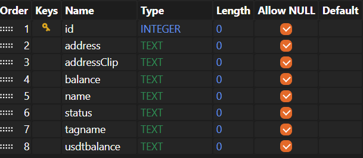

# React.js & Express.js Mobile App - NFT Crypter 


## Getting Started

### Prerequisites

###### To run this project, you need to have Node.js installed on your machine. You can download and install Node.js from [here](https://nodejs.org/en).

### Installation
1. Clone the repository:
```shell
git clone https://github.com/enndylove/React-MobileApp_Crypter.git
```
2. Navigate to the project directory:
```shell
cd React-MobileApp_Crypter
```
3. Install the required dependencies:
```shell
npm install
```
4. Building project (also need to enter this command after making changes in the jsx files)
```shell
npm run build
```

### Prisma ORM commands with clear all information in database

1. Prisma init: Initializes Prisma in your project.
```shell
npx prisma init
```
2. Generate Prisma Client: Generates the Prisma Client.
```shell
npx prisma generate
```
3. Migrate Prisma Dev: Applies the migrations to your database.
```shell
npx prisma migrate dev
```

#### Environment
1. Create a file named `.env` and add the following code:
```text
# Get YOUR_MORALIS_API_KEY from "https://admin.moralis.io/settings#api_keys"
REACT_APP_MORALIS=YOUR_MORALIS_API_KEY

# Get YOUR_WALLETCONNECT_PROJECT_ID from "https://cloud.walletconnect.com/app/project"
REACT_APP_WALLETCONNECT=YOUR_WALLETCONNECT_PROJECT_ID

# Set YOUR_NAME, default "Connect Crypter"
REACT_APP_WALLETCONNECT_NAME="YOUR_NAME"

# Set YOUR_DESCRIPTION, default "Connect Crypter login walletConnect"
REACT_APP_WALLETCONNECT_DESCRIPTION="YOUR_DESCRIPTION"

# Set YOUR_URL, default "https://localhost:5000/"
REACT_APP_WALLETCONNECT_URL="YOUR_URL"

# Set YOUR_ICON, default ["https://avatars.githubusercontent.com/u/37784886"]
REACT_APP_WALLETCONNECT_ICONS=["YOUR_ICON"]

# Set YOUR_PORT, example: 5000
REACT_APP_PORT=YOUR_PORT
```
###### My .env example:
```text
REACT_APP_MORALIS=my_moralis_api_key
REACT_APP_WALLETCONNECT=my_walletconnect_project_id
REACT_APP_WALLETCONNECT_URL="https://localhost:5000/"
DATABASE_URL="file:./dev.db"
```

### Run the project
```shell
npm start
```
###### or
```shell
node server.js
```

## Prisma ORM Database & Local databases SQLite
### Prisma (provider: sqlite)
#### Prisma models: `/prisma/schema.prisma`
```text
model User {
  id       String   @id @default(cuid())
  address  String   @unique
  addressClip String
  balance  String
  name     String
  status   String
  tagname  String
  usdtbalance String
}

model Owned {
  id       String   @id @default(cuid())
  address  String   @unique
  image    String
  name     String
  description String
}

model Collections {
  id       String   @id @default(cuid())
  address  String   @unique
  image    String
  symbol   String
  name     String
  amount   String
}

model Info {
  id       String   @id @default(cuid())
  name     String
  email    String
}
```
#### Prisma datasource & generator
```text
datasource db {
  provider = "sqlite"
  url      = "file:./dev.db"
}

/*{models}*/

generator client {
  provider = "prisma-client-js"
}
```
#### Prisma database `/prisma/dev.db`
##### `Collections` table (collections nfts if contains)

##### `Info` table (subscribe to website)

##### `Owned` table (owned nfts if contains)

##### `User` table (information about wallet address)

##### `_prisma_migrations` table (information about wallet address)

### Local databases(old commit version)
#### Nfts database `/data/nfts.db`
###### Collections table

###### Owned table

#### Users database `/data/users.db`
###### User table

#### Info database (don't have file in project)


## Example Prisma ORM using
```javascript
/*
* Example post request
*/
app.post('/api/profile', async (req, res) => {
  try {
    const profileData = req.body;
    profileData.address = profileData.walletAddress;
    profileData.addressClip = profileData.walletAddressClip;
    profileData.balance = profileData.walletBalance;
    profileData.usdtbalance = profileData.walletUSDTBalance;
    profileData.name = profileData.walletName;
    profileData.tagname = profileData.walletTagName;
    profileData.status = profileData.walletStatus;

    const user = await prisma.user.create({
      data: {
        address: profileData.address,
        addressClip: profileData.addressClip,
        balance: profileData.balance,
        usdtbalance: profileData.usdtbalance,
        name: profileData.name,
        tagname: profileData.tagname,
        status: profileData.status,
      },
    });
    res.json({ status: 'success' });
    console.log(user)
  } catch (error) {
    console.error('Error in /api/profile:', error);
    res.status(500).json({ status: 'error' });
  }
});
```
```javascript
/*
* Example get request
*/
app.get('/api/profile', async (req, res) => {
  const { address } = req.query;

  try {
    const user = await prisma.user.findFirst({
      where: { address },
    });

    if (user) {
      res.json(user);
      console.log("User found:", user);
    } else {
      res.json({});
      console.log("No user found with address:", address);
    }
  } catch (error) {
    console.error("Error fetching user by address:", error);
    res.status(500).json({ status: 'error', message: error.message });
  }
});
```
### useAccount() hook in `Choose.jsx` file
```jsx
import { useAccount } from "wagmi";

/**
 * Connector object from `wagmi`.
 */
const { connector } = useAccount();

/**
 * Effect hook for handling account connection and disconnection.
 */
useAccount({
    /**
     * Callback function for when the account is connected.
     *
     * @param {Object} params - Connection parameters.
     * @param {string} params.address - The connected account address.
     */
    onConnect({ address }) {
        console.log("Connected", { address, connector });
        localStorage.setItem("userAddress", address);
    },
    /**
     * Callback function for when the account is disconnected.
     */
    onDisconnect() {
        localStorage.userAddress.clear();
    },
});
```
### WalletConnect API, Web3 (wagmi) configuration in `Choose.jsx` file
```jsx
/**
 * Project ID for WalletConnect.
 */
const projectId = process.env.REACT_APP_WALLETCONNECT || undefined;

/**
 * Metadata for WalletConnect.
 */
const metaDataName = process.env.REACT_APP_WALLETCONNECT_NAME || "Connect Crypter";
const metaDataDescription = process.env.REACT_APP_WALLETCONNECT_DESCRIPTION || "Connect Crypter login walletConnect";
const metaDataUrl = process.env.REACT_APP_WALLETCONNECT_URL || "https://localhost:5000/";
const metaDataIcons = process.env.REACT_APP_WALLETCONNECT_ICONS || ["https://avatars.githubusercontent.com/u/37784886"];

/**
 * Chain configuration for `wagmi`.
 */
const chains = [mainnet];

/**
 * Configuration for `wagmi`.
 */
const wagmiConfig = defaultWagmiConfig({
    chains,
    projectId,
    metadata: {
        name: metaDataName,
        description: metaDataDescription,
        url: metaDataUrl,
        icons: metaDataIcons,
    },
});

/**
 * Create a Web3 modal instance.
 */
const modal = createWeb3Modal({
    wagmiConfig,
    projectId,
    showQrModal: true,
    chains,
    themeVariables: {
        "--w3m-color-mix": "#010101",
        "--w3m-color-mix-strength": 0,
    },
});
```
### Providers in `index.js` file:
```jsx
/**
 * Import necessary dependencies from React, React Router, and Wagmi.
 */
import React from 'react';
import ReactDOM from 'react-dom/client';
import { BrowserRouter, Routes, Route } from 'react-router-dom';
import { Suspense } from 'react';
import { WagmiConfig, createConfig, configureChains, mainnet } from 'wagmi';
import { publicProvider } from 'wagmi/providers/public';
/**
 * Configure Wagmi chains and providers.
 */
const { publicClient, webSocketPublicClient } = configureChains(
    [mainnet],
    [publicProvider()]
);

/**
 * Create Wagmi config.
 */
const config = createConfig({
    publicClient,
    webSocketPublicClient,
});

/**
 * App component.
 *
 * @returns {JSX.Element} The app component tree.
 */
export default function App() {
    return (
        <BrowserRouter>
            <WagmiConfig config={config}>
                <Routes>
                    <Route
                        index
                        exact
                        element={
                            <Suspense fallback={<Preloader />}>
                                <index_component />
                            </Suspense>
                        }
                    />
                    <Route
                        path="/file_page"
                        element={
                            <Suspense fallback={<Preloader />}>
                                <file_component />
                            </Suspense>
                        }
                    />
                </Routes>
            </WagmiConfig>
        </BrowserRouter>
    );
}

/**
 * Render the app to the DOM.
 */
const root = ReactDOM.createRoot(document.getElementById('root'));
root.render(<App />);
```
## Starting Moralis API
```jsx
const startMoralis = async () => {
    try {
        const moralisApiKey = process.env.REACT_APP_MORALIS;
        await Moralis.start({
            apiKey: moralisApiKey,
        });
        console.log("Moralis started successfully");
    } catch (error) {
        console.error("Moralis is started:");
    }
};
startMoralis();
```


### Moralis API Data in `Header.jsx` file:
```jsx
const responseAddress = await Moralis.EvmApi.wallets.getWalletActiveChains({
    address: address,
});

const chain = responseAddress.raw.active_chains[0]?.chain,
    chainId = responseAddress.raw.active_chains[0]?.chain_id,
    defaultParams = {
        address: address,
        chain: chainId,
}

const balance = await Moralis.EvmApi.balance.getNativeBalance({
    address: address,
    chain: chainId,
});

const name = await Moralis.EvmApi.resolve.resolveAddress({
    address: address,
});

const resp = await Moralis.EvmApi.nft.getWalletNFTs({
    address: address,
    chain: chainId,
});

const formattedBalance = parseFloat(balance.raw.balance) / 10 ** 18

const walletName = name?.raw?.name || `${chain}_${chainId}`

const walletTagName = `@${name?.raw?.name || chain + chainId}`

const clipAddress = `${address.substring(0, 6)}...${address.slice(-4)}`

const whatStatus = resp.raw ? resp.raw.status : "NO SYNCED"

const formaterClip = formattedBalance.toFixed(2)

const usdtBalance = (formaterClip * 2229).toFixed(2)
```

### Example post to server:
```jsx
await fetch("/api/profile", {
    method: "POST",
    headers: {
        "Content-Type": "application/json",
    },
    body: JSON.stringify({
        walletAddress,
        walletBalance,
        walletUSDTBalance,
        walletName,
        walletTagName,
        walletStatus,
        walletAddressClip
    }),
});
```
### Example get data from server:
```jsx
try {
    const request = await fetch("/api/profile", {
        method: "GET",
        headers: {
            "Content-Type": "application/json",
        },
    });
    
    if (!request.ok || !request.ok) {
        throw new Error("Network response was not ok");
    }
    
    const data = await request.json();
    
    console.log(
        walletAddress,
        walletBalance,
        walletUSDTBalance,
        walletName,
        walletTagName,
        walletStatus,
        walletAddressClip
    )
    
} catch (error) {
    console.error("Error fetching data", error);
}
```

## Random avatars href function
```jsx
function randomAvatar() {
    const avatars = [
        "https://i.seadn.io/gcs/files/e682d6a6f6e2c46ad24a518b860d3296.png?auto=format&dpr=1&w=1000",
        "https://i.seadn.io/gcs/files/d5c725ebe84f336783c345eb8afee8ab.png?auto=format&dpr=1&w=1000",
        "..."
    ];
    const random = Math.floor(Math.random() * avatars.length)
    
    return avatars[random]
}
randomAvatar(); // @example return "https://i.seadn.io/gcs/files/e682d6a6f6e2c46ad24a518b860d3296.png?auto=format&dpr=1&w=1000"
```

## Set avatar and banner pictures in input: 
```jsx
/* @example avatar */
const setPictures = () => {
    const [avatarImage, setAvatarImage] = useState(null);
    
    const defaultImage = 'DEFAULT_IMAGE_Url';
    
    const srcImage = avatarImage ? 
        URL.createObjectURL(avatarImage) : 
        defaultImage
    
    return (
        <>
            {/* view image */}
            
            {/* label button for set image */}
            <label className="content__photos-upload pointer font-button color-darken">
                upload
            </label>
            {/* input for set avatar */}
            <input
                type="file"
                id="avatar"
                name="image_target"
                className="d-none"
                onChange={(event) => {
                    console.log(event.target?.files[0]);
                    setAvatarImage(event.target?.files[0]);
                }}
            />
        </>
    )
}
```

## class ImageFactory for set picture in input
```jsx
/**
 * A class that provides utility functions for loading images
 */
class ImageFactory {
    /**
     * The default image URL to use when no URL is provided
     * @type {string}
     */
    static defaultImage = "https://i.ibb.co/PWhrW7k/Frame-1361.jpg";

    /**
     * Loads an image from a URL
     * @param {string|null} url - The URL of the image to load
     * @returns {string} The URL of the loaded image
     */
    static loadImage(url) {
        return url ? URL.createObjectURL(url) : this.defaultImage;
    }
}
```

### [Figma link](https://www.figma.com/design/I6EpT8xrNzIQU4tvAiHCW9/Crypter-v.2---Figma?node-id=242-11219&t=wndgjF07m2xuYBUS-1)
## License
#### This project is licensed under the [MIT License](https://github.com/enndylove/React-MobileApp_Crypter/blob/main/LICENSE.md).

### Delicious coffee to you friends ☕
